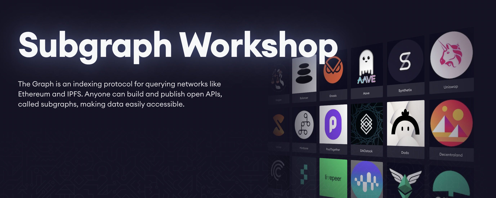

## The Graph - MoonLotto Subgraph Workshop

Learn how to build a GraphQL API to query data for a Lottery contract on Moonbase Alpha.

> See also [Using The Graph on Moonbeam](https://docs.moonbeam.network/integrations/thegraph/)



### Prerequisites

To be successful in this workshop, you should have [Node.js](https://github.com/nvm-sh/nvm#node-version-manager---) installed on your machine.

## Getting started

### Creating the Graph project in the Graph console

To get started, open the [Graph Console](https://thegraph.com/explorer/dashboard) and either sign in or create a new account.

Next, go to [the dashboard](https://thegraph.com/explorer/dashboard) and click on __Add Subgraph__ to create a new subgraph.

Here, set your graph up with the following properties:

- Subgraph Name - __Moonbeamsubgraph__ (or your preferred name)
- Subtitle - __A subgraph for querying data from Moonbase__
- Optional - Fill the description and GITHUB URL properties

Once the subgraph is created, we will initialize the subgraph locally.

### Clone the example project

Next, we'll be using the example [Moonlotto subgraph](https://github.com/PureStake/moonlotto-subgraph)

Clone the repo locally, then change into the new directory and install the dependencies:

```sh
git clone git@github.com:PureStake/moonlotto-subgraph.git

cd moonlotto-subgraph
```

Install the node dependencies using yarn:

```sh
yarn
```

Create the TS types for The Graph (requires the artifacts folder created by contract compilation). Files will be created in the __src/types__ directory:

```
yarn codegen
```

In __src/mappings__ you will see code including imports for the types that were generated by the CLI:

```typescript
import {
  PlayerJoined,
  LotteryResult,
} from "./types/MoonLotto/MoonLotto";
import { Round, Player, Ticket } from "./types/schema";
```

Graph Node finds smart contract events for your subgraph and runs the mapping handlers you provided. The mapping is a WASM module that creates or updates the data entities that Graph Node stores in response to Ethereum events.

These events are defined in the __Subgraph.yml__ file along with the smart contract address, start block, entities that you would like to index, and other configurations:

```yaml
specVersion: 0.0.2
description: Moonbeam lottery subgraph tutorial
repository: https://github.com/PureStake/moonlotto-subgraph
schema:
  file: ./schema.graphql
dataSources:
  - kind: ethereum/contract
    name: MoonLotto
    network: mbase
    source:
      address: '0x0bb1ac004BacefFb1fb1a4aA3f74835372A5deD0'
      abi: MoonLotto
      startBlock: 33206
    mapping:
      kind: ethereum/events
      apiVersion: 0.0.4
      language: wasm/assemblyscript
      file: ./src/mapping.ts
      entities:
        - Player
        - Round
        - Ticket
      abis:
        - name: MoonLotto
          file: ./artifacts/contracts/MoonLotto.sol/MoonLotto.json
      eventHandlers:
        - event: PlayerJoined(uint256,address,uint256,bool,uint256)
          handler: handlePlayerJoined
        - event: LotteryResult(uint256,address,uint256,bool,uint256,uint256)
          handler: handleLotteryResult
```

The GraphQL Schema located at __schema.graphql__ defines the entities to be indexed as well as the fields for each entity / type:

```graphql
type Round @entity {
  id: ID!
  index: BigInt!
  prize: BigInt! 
  timestampInit: BigInt!
  timestampEnd: BigInt
  tickets: [Ticket!] @derivedFrom(field: "round")
}

type Player @entity {
  id: ID!
  address: Bytes!
  tickets: [Ticket!] @derivedFrom(field: "player")
}

type Ticket @entity {
  id: ID!
  isGifted: Boolean!
  player: Player!
  round: Round!
  isWinner: Boolean!
}
```

The `eventHandlers` in __subgraph.yaml__ define the events that will be handled in the mappings and map the event to a function specified in `src/mappings.ts`:

```typescript
// src/mapping.ts
import {
  PlayerJoined,
  LotteryResult,
} from "./types/MoonLotto/MoonLotto";
import { Round, Player, Ticket } from "./types/schema";

export function handlePlayerJoined(event: PlayerJoined): void {
  // ID for the round
  let roundId = event.params.round.toString();
  // try to load Round from a previous player
  let round = Round.load(roundId);
  // if round doesn't exists, it's the first player in the round -> create round
  if (round == null) {
    round = new Round(roundId);
    round.timestampInit = event.block.timestamp;
  }
  round.index = event.params.round;
  round.prize = event.params.prizeAmount;

  round.save();

  // ID for the player:
  // issuer address
  let playerId = event.params.player.toHex();
  // try to load Player from previous rounds
  let player = Player.load(playerId);
  // if player doesn't exists, create it
  if (player == null) {
    player = new Player(playerId);
  }
  player.address = event.params.player;

  player.save();

  // ID for the ticket (round - player_address - ticket_index_round):
  // "round_number" + "-" + "player_address" + "-" + "ticket_index_per_round"
  let nextTicketIndex = event.params.ticketIndex.toString();
  let ticketId = roundId + "-" + playerId + "-" + nextTicketIndex;

  let ticket = new Ticket(ticketId);
  ticket.round = roundId;
  ticket.player = playerId;
  ticket.isGifted = event.params.isGifted;
  ticket.isWinner = false;

  ticket.save();  
}

export function handleLotteryResult(event: LotteryResult): void {
  let roundId = event.params.round.toString();    
  // ID for the round:
  // round number
  let round = Round.load(roundId);  
  round.prize = event.params.prizeAmount;
  round.timestampEnd = event.block.timestamp;
  
  round.save();
  
  let ticketIndex = event.params.ticketIndex.toString();
  let playerId = event.params.winner.toHex();  
  let ticketId = roundId + "-" + playerId + "-" + ticketIndex;
  // ID for the ticket:
  // "round_number" + "-" + "player_address" + "-" + "ticket_index"
  let ticket = Ticket.load(ticketId);  
  ticket.isWinner = true;
  
  ticket.save();
}
```

#### Updating the deploy script

Next, open __package.json__ and update the `deploy` script to include the project name from the Graph explorer.

Replace the subgraph name. It should look something like this: `username/subgraphname`:

```sh
"deploy": "npx graph deploy username/subgraphname --ipfs https://api.thegraph.com/ipfs/ --node https://api.thegraph.com/deploy/",
```

### Deploying the subgraph

You should now be able to deploy the subgraph:

```sh
yarn deploy
```

Once the subgraph has been deployed, you should be able to open the Graph Explorer and query data from the subgraph.

Try out the following queries to see what selection sets you are able to query from your API:

```graphql
# rounds
{
  rounds {
    id
    index
    prize
    timestampInit
  }
}

# rounds with order direction
{
  rounds(
    orderDirection: desc
    orderBy: id
  ) {
    id
    index
    prize
    timestampInit
  }
}

# tickets
{
  tickets {
    id
    isGifted
    isWinner
    round {
      id
      index
      timestampEnd
    }
    player {
      id
      id
    }
  }
}

# players
{
	players {
    id
    address
    tickets {
      id
      isGifted
      isWinner
      round {
        id
        prize
        index
      }
    }
  }
}
```